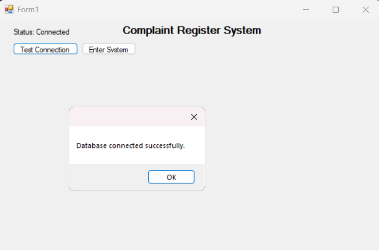
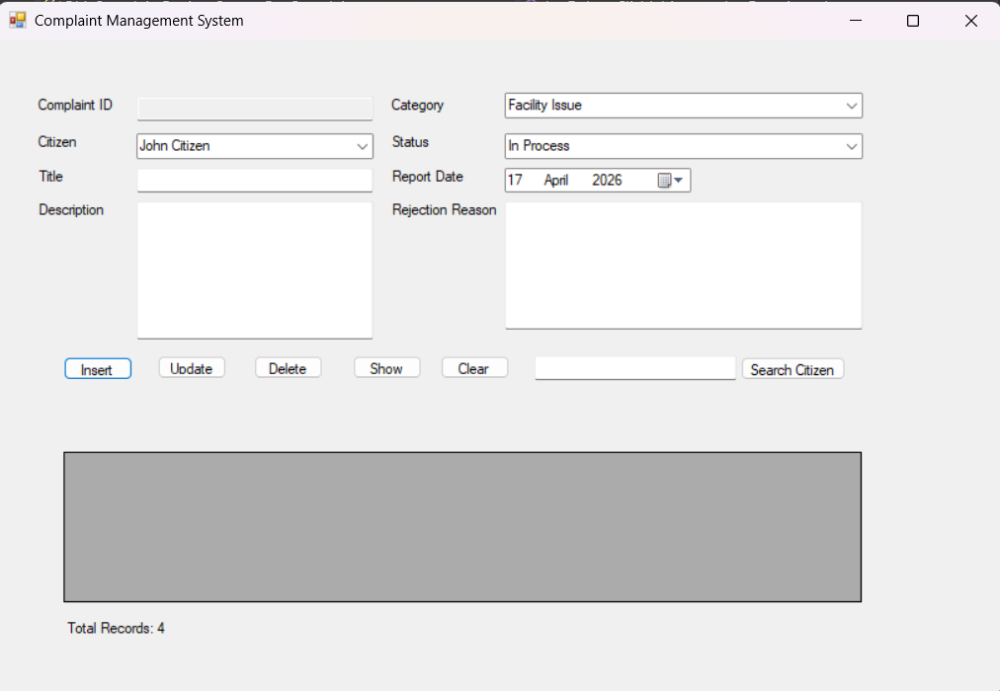
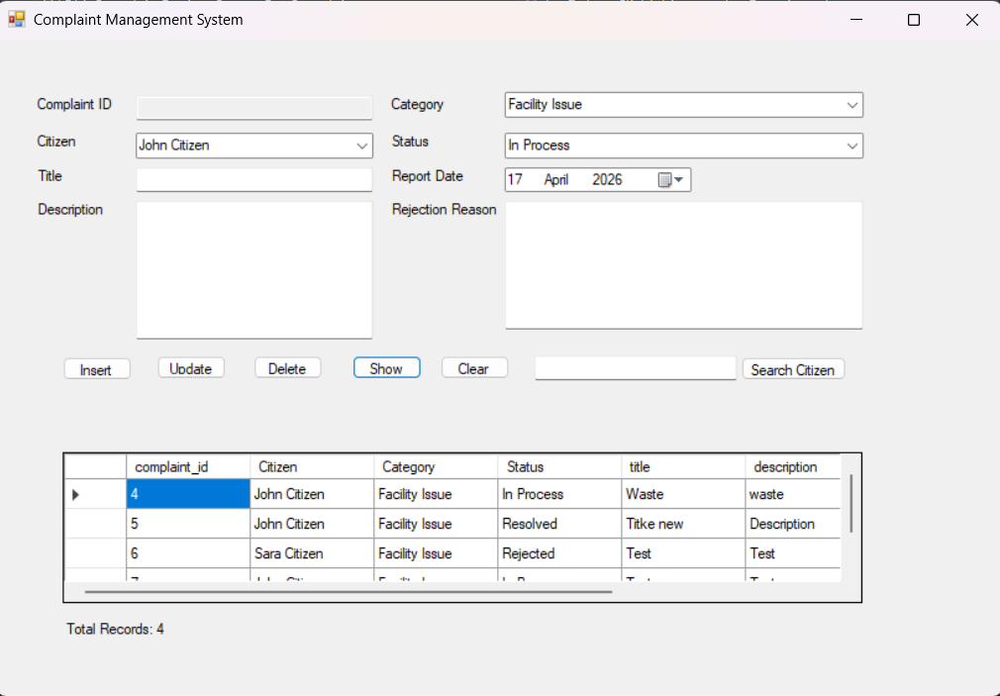
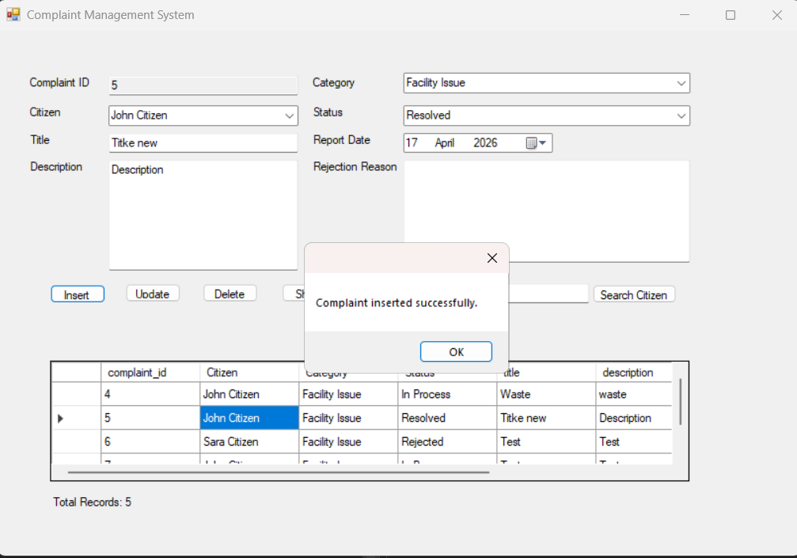
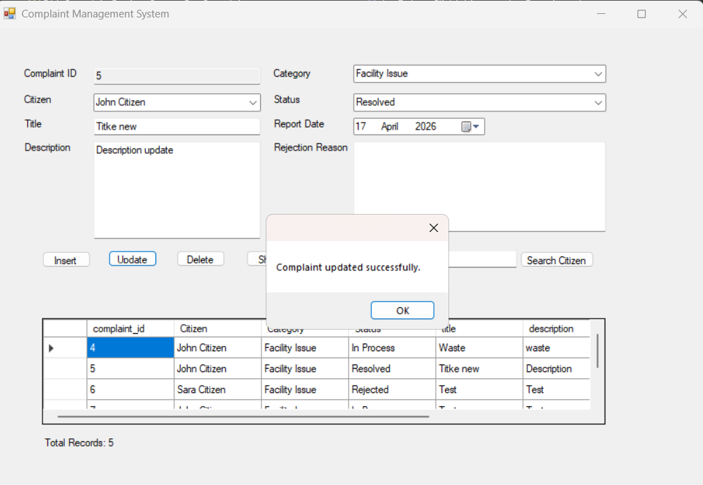
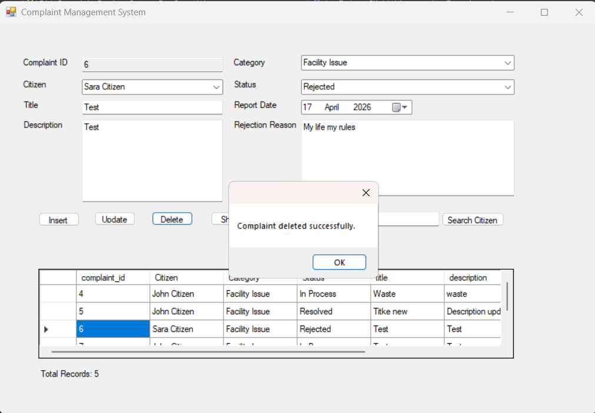
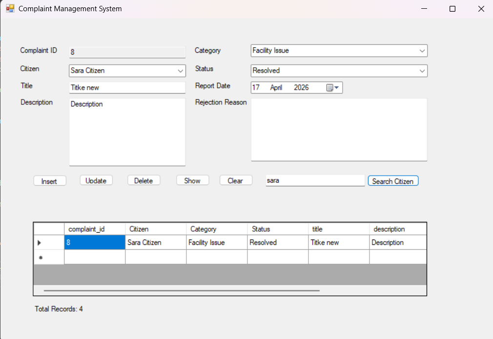

# F14_ComplaintRegisterSystem

Environmental Complaint Register System built with:

- C#
- Windows Forms
- SQL Server
- ADO.NET

## Features

- Database connection test
- Insert complaint
- Update complaint
- Delete complaint
- Search complaint
- Show data in DataGridView
- Total records counter
- Validation system
- Rejected complaint logic

## Screenshots

### Connection Form

### Input Form

### Data Display

### Insert Evidence

### Update Evidence

### Delete Evidence

### Search Evidence

